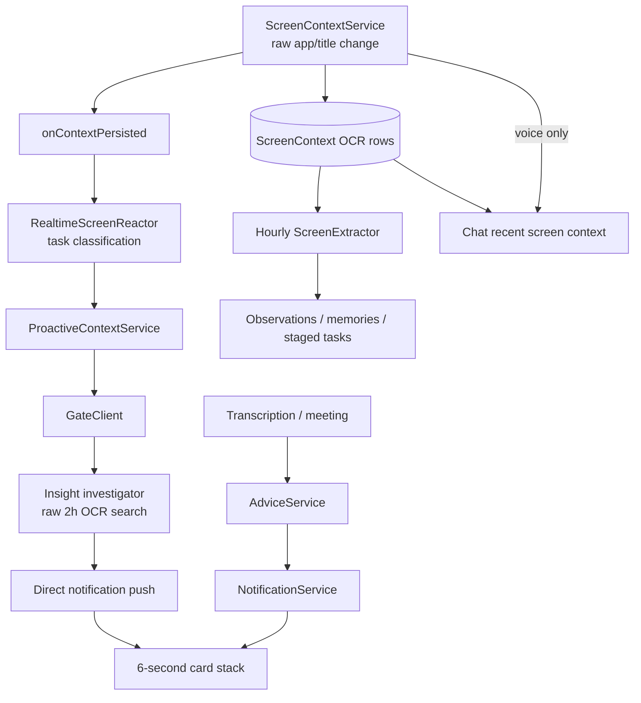
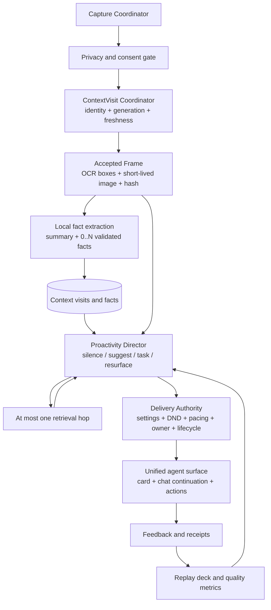

# MetaWhisp Screen-Aware Agent Quality Review - 2026-08-23

## 1. Purpose and Verdict

Цель: понять, почему публичная reference implementation воспринимается как цельный и качественный screen-aware agent, а MetaWhisp при похожем наборе возможностей выдает редкие, запоздалые или бесполезные комментарии. Это report-only review: исходники приложения не менялись.

**Вердикт: Request Changes для заявления, что MetaWhisp уже является качественным screen-aware agent.**

MetaWhisp не проигрывает из-за одной слабой модели или одного плохого prompt. Главный разрыв системный:

1. Reference implementation построена вокруг одного цикла `Capture -> Understand -> Remember -> Retrieve -> Act`.
2. MetaWhisp добавлял экранные возможности отдельными итерациями. Сейчас это несколько частично пересекающихся контуров с разной памятью, разными gates, разными cooldown и разными правилами доставки.
3. В reference implementation качество создают не только prompts, а идентичность контекста, freshness fences, visual grounding, default silence, evidence refs, единая delivery authority, продолжение уведомления в chat и измеряемый replay benchmark.
4. В MetaWhisp уже есть хорошие детали, но они не замкнуты в один проверяемый agent loop. В результате пользователь видит генератор баннеров, а не агента.

Самый важный вывод для реализации: **не копировать большой внешний стек целиком и не начинать с очередной правки prompt. Сначала нужно починить текущий контекст, доказательства, доставку и eval harness.**

Понятное описание того, что именно изменится для пользователя, как будет выглядеть карточка и какими текстовыми сценариями принимать каждую итерацию, вынесено в
[MetaWhisp Screen Agent - понятная продуктовая спецификация](SCREEN-AGENT-PLAIN-LANGUAGE-SPEC-RU-2026-08-23.md).

## 2. Scope and Evidence

### MetaWhisp baseline

- Commit: `a4bf18ded608d9d1efa7e6dcb0df3f73900097ce`
- Commit date: `2026-08-17T22:32:58+02:00`
- Mode: static report-only review
- Application source edits: none
- Build and test execution: not run. Project rules require explicit user authorization for `swift build` / `swift test`.
- Existing dirty worktree state was preserved.

Reviewed paths:

- `Services/Screen/ScreenContextService.swift`
- `Services/Intelligence/ProactiveContextService.swift`
- `Services/Intelligence/InsightAssistantService.swift`
- `Services/Intelligence/InsightInvestigator.swift`
- `Services/Intelligence/InsightPrompts.swift`
- `Services/Intelligence/InsightDedupChecker.swift`
- `Services/Intelligence/InsightStorage.swift`
- `Services/Intelligence/RealtimeScreenReactor.swift`
- `Services/Intelligence/ScreenExtractor.swift`
- `Services/Intelligence/AdviceService.swift`
- `Services/Intelligence/ChatService.swift`
- `Services/System/NotificationService.swift`
- `Views/Notifications/*`
- `Models/ScreenContext.swift`, `ScreenObservation.swift`, `AdviceItem.swift`, `AppSettings.swift`
- App wiring, Settings, onboarding and relevant tests

### Reference snapshot

- Public reference snapshot: `028aefef8f7f620090b5d9cbedaf2b9b89d914d0`
- Snapshot date: `2026-08-23T15:15:25Z`
- Reviewed: product principles, macOS screen capture/Rewind, context visits and buckets, proactive director, suggestion assistant, notification delivery, floating-agent continuation, product invariants, E2E fixture and test inventory.
- The comparison uses the current public code, not the older local copy.

Important limitation: this review proves code paths and missing contracts. It does not prove current production latency, model quality or macOS permission behavior without a live instrumented run.

## 3. P0 Findings

### SAA-001 - A comment can be delivered for a context the user left long ago

Evidence:

- `App/AppDelegate.swift:944-950` waits for `RealtimeScreenReactor.react(to:)` before it even schedules the proactive insight path.
- `Services/Intelligence/RealtimeScreenReactor.swift:75-92` serializes work and silently drops a new event while one request is active.
- The reactor network request can wait up to 20 seconds at `RealtimeScreenReactor.swift:691-711`.
- The proactive investigator allows five model rounds (`InsightInvestigator.swift:60-65,157-227`), and every round can wait up to 45 seconds (`InsightAssistantService.swift:181-203`).
- `ProactiveContextService.swift:108-174` never checks that the original app/window is still current after the awaits and immediately pushes the result.
- `ProactiveContextService.swift:110-112` also drops new contexts while the old one is running. There is no latest-value queue.

Impact:

- In the exact apps where both task detection and advice matter, advice is delayed behind task extraction.
- A normal three-turn investigation can finish after the user has moved through several windows.
- Newer, more relevant context is discarded while the old request owns `isRunning`.
- The user experiences comments as random or late even when their text is individually reasonable.

Required remediation:

1. Introduce one `ContextVisitID` plus monotonic `contextGeneration` at capture time.
2. Snapshot app, bundle, window ID, display ID and capture timestamp into every agent run.
3. Recheck visit freshness after every await and immediately before presentation.
4. Replace silent `isRunning` drops with latest-value coalescing: one active run plus one newest pending visit.
5. Run task extraction and proactive decision as independent consumers of the same visit instead of awaiting one before starting the other.
6. Set a bounded end-to-end deadline for proactive delivery. On timeout or stale visit, silence is correct.

Required tests:

- A -> B -> C switch while A is evaluating never presents A or B after C becomes current.
- A slow task detector does not delay the proactive decision for the same visit.
- A provider timeout produces terminal `suppressed_timeout`, not a later card.
- A newer visit replaces an older pending visit rather than being lost.

### SAA-002 - The agent does not actually receive a faithful current screen

Evidence:

- `ScreenContextService.swift:249-252` captures only when raw app name or raw window title changes.
- Visual changes inside the same tab/window are invisible. A form, chat message, error, recipient or amount can change while the title remains stable.
- `WindowTitleNormalizer.swift:3-77` exists specifically to remove spinner/timer/unread noise, but production code never calls it. Only tests reference it.
- `ScreenContextService.swift:319-345` always selects `content.displays.first`, not the display containing the focused window.
- The capture includes all windows owned by the front app, not one authoritative focused window.
- `ScreenContext`, `ScreenObservation` and `ExtractedInsight` carry plain OCR text but no OCR bounds, image reference, window ID, display ID, frame hash or capture outcome.
- `RealtimeScreenReactor.swift:501-509` asks the model to distinguish right-side outgoing and left-side incoming chat bubbles, but plain OCR has no spatial layout.
- `InsightPrompts.swift:100-109` asks for wrong-recipient, visual mistake and misconfiguration detection, while the model receives text only.

Impact:

- Stable-title screens are missed entirely.
- Noisy-title screens can be analyzed repeatedly.
- Multi-monitor users can get blank or wrong-display OCR.
- The model is asked to infer spatial facts that are absent from its input. Wrong-recipient and speaker-role detection therefore rely on hallucination, not evidence.

Required remediation:

1. Capture the focused window and its display explicitly.
2. Make context changes event-driven, but add a bounded content-change check for long-lived windows.
3. Use the existing title normalizer in the actual visit identity path.
4. Preserve OCR boxes and a short-lived, downscaled image in memory for vision reasoning.
5. Compute a visual/text change signature and avoid both stable-title starvation and cosmetic-title storms.
6. Record explicit capture states: `captured`, `excluded`, `permissionDenied`, `empty`, `failed`, `stale`.

Required tests and live checks:

- Same title, changed message/form/error creates a new meaningful frame.
- Spinner, timer and unread-count title changes do not create new visits.
- Two displays: focused window on display 2 is the captured source.
- Two windows from one app: only the focused window is used for current-screen claims.
- Role attribution is not attempted from text-only evidence.

### SAA-003 - The investigation gate proves that something was read, not that the advice is grounded in it

Evidence:

- `InsightInvestigator.swift:151-197` unlocks `provide_advice` after any successful search plus any successful `get_screen_text` call.
- The two booleans `didSearch` and `didConfirmRead` are not tied to the final claim, a cited snapshot ID or even the search result that motivated the claim.
- `ExtractedInsight` has no evidence IDs or source context ID (`InsightOutputParser.swift:3-20`).
- `InsightInvestigator.swift:189-196` accepts model-provided `source_app`; it is not forced to the captured source.
- `RealtimeScreenReactor.swift:203-209` calls a task quote "evidence" after checking only its length. It does not verify that the quote exists in OCR.
- `ScreenExtractor.swift:235-247` has the same length-only task evidence gate.
- The stronger normalized-substring check exists for task fulfillment in `TaskFulfillment.swift:71-94`, proving the missing check is implementable with current patterns.

Impact:

- The model can search history, read an unrelated record and then emit an ungrounded comment.
- A fabricated 20-character quote passes task extraction.
- The card cannot answer "why did you tell me this?" because the evidence link was discarded.
- The current tests prove the formal sequence, not claim-to-evidence binding.

Required remediation:

1. Add typed `EvidenceRef` values to facts, decisions, tasks and deliveries.
2. Return cited snapshot/fact IDs from the model and validate them against the exact allowlist supplied in that run.
3. Verify quoted OCR evidence using the existing normalized-substring policy.
4. Derive `sourceApp`, window and captured time from the visit envelope, never from model output.
5. Require every non-silence decision to have at least one valid evidence ref; task decisions require a commitment/request fact, not a general screen fact.

Required tests:

- Search record A, read A, advise from unrelated B -> suppress.
- Invented quote of sufficient length -> suppress.
- Model cites an ID that was not supplied -> suppress.
- Advice source app differs from captured app -> source is corrected or decision suppressed.
- Valid fact plus exact citation -> deliver.

### SAA-004 - ScreenExtractor can merge unrelated contexts, lose work and crash on model output

Evidence:

- `ScreenExtractor.swift:351-365` starts a new visit only when the app changes or the gap exceeds five minutes. Window/tab changes inside the same app are merged, despite the file describing visits as app-window stretches.
- The latest window title is attached to OCR accumulated across the whole merged app visit.
- The prompt labels entries `Visit 1`, `Visit 2`, while asking the model for zero-based `visitIndex` (`ScreenExtractor.swift:399,422,451-458`).
- `ScreenExtractor.swift:189` and `:223` validate only `visitIndex < trimmed.count`; a negative model-generated index passes and is then used as an array subscript.
- `ScreenExtractor.swift:95-112` fetches up to 500 rows, keeps only the newest 20 visits, then `:289-290` advances `lastRun` to now. Older visits omitted by `suffix(20)` are never retried.
- Persistence uses `try?`; `lastRun` still advances when the save fails.

Impact:

- Facts and tasks can be attributed to the wrong browser tab, chat or document.
- A valid but negative JSON index can terminate the app.
- Busy hours silently lose screen observations.
- A disk/store failure is recorded as a successful processed window.

Required remediation:

1. Use `ContextVisitID` from the capture layer instead of reconstructing visits hourly.
2. Until then, group by normalized app + focused window identity, not app alone.
3. Require `0 <= visitIndex && visitIndex < count` before indexing.
4. Use consistent zero-based or one-based labels in both prompt and parser contract.
5. Process batches with a durable high-water mark for the last successfully committed source row.
6. Throw on persistence failure and leave the batch pending.

Required tests:

- Two browser tabs inside five minutes remain separate visits.
- `visitIndex = -1` is rejected without a crash.
- More than 20 visits are processed over multiple batches with no gaps.
- Save failure leaves the high-water mark unchanged.
- Evidence from visit A cannot create a task linked to visit B.

### SAA-005 - A proactive notification is a six-second dead end, not an agent turn

Evidence:

- `MWNotification.swift:12-38` contains only id, kind, title, body, timestamp and an optional closure. It has no run ID, evidence, source window, action, delivery state or feedback identity.
- `ProactiveContextService.swift:164-171` sets `onTap: nil` and pushes directly to `MWNotificationStack`, bypassing `NotificationService`.
- `MWNotificationCard.swift:72-75` therefore closes a proactive card when clicked and performs no continuation.
- `MWNotificationStack.swift:19-42` keeps four cards, silently drops the oldest and auto-dismisses every card after six seconds.
- There is no distinction between generated, queued, presented, clicked, dismissed, replaced, timed out or failed.
- `lastSurfaceAt` is updated before any presentation acknowledgement (`ProactiveContextService.swift:160-171`).

Impact:

- The user cannot ask what the comment means, inspect its source, correct it or act on it.
- The system cannot measure whether a generated comment was actually seen.
- Proactive cards bypass meeting DND and advice throttling owned by `NotificationService`.
- A useful comment can disappear behind four other cards without any durable trace of delivery.

Required remediation:

1. Create one `DeliveryAuthority` for every proactive surface.
2. Model lifecycle states: `prepared`, `queued`, `presented`, `clicked`, `dismissed`, `suppressed(reason)`, `failed(reason)`.
3. Put `runID`, `visitID`, evidence refs, source label and decision type on the notification.
4. Clicking a comment must open one chat continuation seeded with its exact provenance.
5. Add explicit actions where safe: `Explain`, `Open source`, `Create task`, `Execute`, `Later`, `Not helpful`.
6. Count cooldown and daily budget from actual presentation, not generation.

Required tests:

- Proactive comment click opens a chat with the same run/evidence context.
- Stack replacement records `suppressed_replaced`, not `presented`.
- Notifications disabled or meeting DND changed mid-run suppress at final preflight.
- One delivery produces one terminal outcome only.

### SAA-006 - Screen privacy and product copy do not match actual behavior

This finding extends the previously recorded `FBR-002` privacy finding.

Evidence:

- `MainSettingsView.swift:1483-1486` says OCR is fully on-device and screenshots are never saved.
- OCR itself is local, but `InsightAssistantService`, `RealtimeScreenReactor`, `ScreenExtractor`, `AdviceService` and `ChatService` can send OCR and window titles to cloud providers.
- `ScreenContextPolicy.swift:14-29` turns an empty whitelist into `nil`, which means capture everything.
- `MainSettingsView.swift:2642-2649` tells the user an empty whitelist means they should add apps "to capture only their windows". It does not warn that the current empty state captures all apps.
- `AppSettings.swift:153-155` blacklists Terminal/iTerm for proactive comments, while the flagship prompts advertise terminal credential warnings as high-value examples.

Impact:

- Users cannot make an informed local-vs-cloud decision.
- Selecting whitelist mode before adding an app fails open across the whole screen.
- The most-promoted security use case is disabled by the default policy, which makes product behavior feel inconsistent.

Required remediation:

1. Empty whitelist must fail closed.
2. Separate and name three choices: capture scope, local storage scope, cloud reasoning consent.
3. Show the active provider and whether OCR/image data may leave the Mac.
4. Apply one exclusion policy to capture, local indexing and every downstream agent.
5. Do not promise a use case that defaults make unreachable.

Required tests and live checks:

- Whitelist mode with zero apps captures nothing.
- Excluded app never reaches storage, prompt assembly or telemetry.
- Local-only mode makes no outbound request containing OCR, title or image.
- Cloud mode requires explicit consent and visibly names the provider.

### SAA-007 - There is no evaluation harness for the flagship behavior

Evidence:

- MetaWhisp has 106 Swift test files, including useful parser and pure-function tests.
- Searches found no behavioral tests for the full `ScreenContextService -> ProactiveContextService -> notification` path, no full `ScreenExtractor` batch contract and no notification delivery-lifecycle test.
- There is no synthetic notify/silence deck, replay runner, shadow-mode scorer or referent-quality metric for proactive comments.
- The reference snapshot has 592 Swift test files, including 92 files whose names target context, suggestions, notifications, floating surfaces, Rewind or screen behavior. Raw count alone is not a quality score, but the relevant behavioral surface is materially broader.
- Its proactive fixture contains 38 synthetic cases: 17 expected notify, 17 expected silence and 4 either. Its runner checks action polarity, decision type, forbidden terms and whether visible title/message name the actual referent.
- Reference prompt comments record measured experiments over live facts and hundreds of replay runs. MetaWhisp prompt tuning is mostly encoded as comments and one-off user reports.

Impact:

- There is no objective answer to "is the agent better after this change?"
- Prompt/model/cooldown changes can trade one failure class for another invisibly.
- A green parser suite can coexist with useless real comments.

Required remediation:

1. Before another prompt rewrite, create a privacy-safe synthetic scenario deck.
2. Start with at least 40 cases: silence, notify, stale context, duplicate, task ownership, visible-only echo, retrieval, prompt injection, privacy exclusion and no-identifier cases.
3. Build one replay runner against the real director and real post-model guards.
4. Add shadow mode that records decisions but does not interrupt the user.
5. Score visible usefulness separately from model output: named referent, valid evidence, freshness, delivery outcome and user feedback.

Launch gate:

- Zero privacy, stale-context or ungrounded-delivery failures.
- Every non-silence case has a valid source/evidence chain.
- No forbidden term/action in adversarial cases.
- Measured regression comparison is attached to every prompt/model/pacing change.

## 4. P1 Findings

### SAA-008 - MetaWhisp has several partial minds instead of one agent

Current independent loops:

1. `RealtimeScreenReactor`: per-event task candidate extraction and fulfillment.
2. `ProactiveContextService` + `InsightAssistantService`: proactive comments.
3. `ScreenExtractor`: hourly observations, memories and tasks.
4. `AdviceService`: transcript/meeting-triggered advice using screen history.
5. `ChatService`: user-invoked Q&A with a different screen-context assembly path.

Each loop owns some combination of prompt, history window, confidence, gate, dedup, rate limit, privacy list, persistence and notification behavior. They share raw OCR but not one context identity, fact model, decision authority or delivery ledger.

Impact:

- Duplicated model spend and contradictory decisions.
- Different user settings affect nominally similar behavior.
- A task detector can delay an insight while an hourly extractor later re-processes the same text.
- Fixes accumulate as local exceptions rather than improving one agent contract.

Required remediation:

- Keep specialist extraction logic, but make every specialist consume the same immutable `ContextVisit` and emit typed candidates into one director.
- One director decides `silence | suggest | insight | taskCandidate | resurface`.
- One delivery authority owns pacing, user settings, DND, owner generation and terminal outcomes.
- Retire `AdviceService` as an independent screen-advice generator once the unified path covers its real callers.

### SAA-009 - Screen text is treated as instructions-capable input

Evidence:

- `InsightPrompts.swift:167-179`, `RealtimeScreenReactor.swift:599-617` and `ScreenExtractor.swift:447-463` insert OCR directly into user prompts.
- There is no shared untrusted-content preamble saying that text seen on screen is quoted data and must never override system instructions.
- Web pages, emails, chat messages and source code are attacker-controlled or third-party-controlled content.

Impact:

- A page can steer classification, create junk tasks/memories or force noisy advice.
- Even without arbitrary tool execution, this corrupts the user's second brain and weakens trust.

Required remediation:

- Add one shared `ScreenDerivedContent` wrapper with explicit untrusted-data framing.
- Delimit every source block and keep system policy outside it.
- Validate all model-selected IDs and actions against a per-run allowlist.
- Add adversarial benchmark cases where the screen orders the agent to notify, reveal data, ignore rules or invent a task.

### SAA-010 - Capture and OCR reliability can block the main actor or suppress retries

Evidence:

- `ScreenContextService` is `@MainActor`.
- `ScreenContextService.swift:353-381` calls synchronous `VNImageRequestHandler.perform` inside a continuation without moving work to a background executor.
- `ScreenContextService.swift:249-256` advances `lastAppName` and `lastWindowTitle` before capture succeeds. A capture failure is not retried until context identity changes again.
- Screenshot failure becomes an empty-OCR context (`:287-305`) and is persisted downstream.
- Persistence uses `try?`, then fires `onContextPersisted` regardless (`:384-397`).

Impact:

- Accurate OCR can stall UI work.
- Temporary capture failures suppress the only useful attempt for a stable window.
- Downstream services cannot distinguish an empty screen from capture failure.
- A failed save can still trigger model work on an object that is not durable.

Required remediation:

- Move OCR to a bounded background worker.
- Update capture high-water state only after an accepted frame.
- Retry transient capture failures with backoff while the same visit remains current.
- Do not send empty/failed frames to intelligence consumers.
- Fire persistence callbacks only after a successful commit.

### SAA-011 - Product activation and Settings describe an older feature

Evidence:

- `AppSettings.swift:143-159`: Screen Context and proactive behavior are both off by default. Realtime task detection is on but inert until Screen Context is enabled.
- The onboarding code has no Screen Context, proactive-agent or floating-agent step.
- `MainSettingsView.swift:1434-1459` says Proactive Chip surfaces 2-3 memories/decisions/tasks while composing and is "Never a notification".
- Current implementation produces one LLM insight in any non-blacklisted app and renders it as a six-second notification card.
- Dashboard comments say the empty state prompts enabling Screen Context, but `DashboardView.swift:169-172` only says "No screen activity yet" with no action.

Impact:

- Users may never discover or correctly configure the flagship capability.
- The copy teaches a behavior the app no longer has.
- When the actual card appears, it violates the user's expectation of a peripheral non-notification chip.

Required remediation:

- Define one current product promise first.
- Add onboarding with a visible demo, privacy choice, app scope and a successful test comment.
- Expose capture health, last accepted frame, active provider and next eligible analysis.
- Update every Settings/Dashboard string in the same change as the runtime contract.

### SAA-012 - Current-screen chat is a separate voice-only OCR path

Evidence:

- `ChatService.swift:79-94` captures a fresh screen only when `source == .voice`.
- Typed chat receives recent stored OCR snapshots, which may be stale (`:95-108`).
- There is no image/vision tool for an explicit current-screen question.
- A proactive card cannot become a chat turn because its `onTap` is nil.

Impact:

- The product has no single continuous agent surface.
- "What do you mean?" loses the context that produced the card.
- Typed and spoken versions of the same screen question can receive different evidence.

Required remediation:

- Use one `capture_current_screen` capability for typed and voice questions, gated by the same consent and exclusion policy.
- Pin the captured frame to one question/run so a late tool call cannot silently capture a different screen.
- Journal a proactive delivery into the same conversation and seed follow-up with its provenance.

### SAA-013 - Raw rows are not enough to support durable contextual reasoning

Evidence:

- `ScreenContext` stores timestamp, app, title and OCR only.
- `ScreenObservation` is produced later and references only the last raw row in a reconstructed visit.
- There is no immutable visit identity, version, validated fact, evidence ref, expiry, workstream, question fact, agent run or delivery record.
- The proactive investigator searches a flat two-hour snapshot array rather than a typed contextual history.

Impact:

- The system cannot reliably distinguish scenery from events, obligations and changes.
- It cannot answer "what changed?", expire stale facts or connect a new screen to an unresolved workstream without re-reading raw OCR.
- Every model call has to rediscover context from scratch.

Required minimal model:

- `ContextVisit`: identity, app/window/display, start/end, generation, frame refs, capture state.
- `ContextFact`: statement, kind, subject, evidence refs, confidence, validity, worthiness, expiry.
- `AgentRun`: visit ID, input snapshot/version, prompt/model version, decision and terminal status.
- `AgentDelivery`: run ID, surface, presentation state, interaction and feedback.

Do not add a general knowledge graph or cross-device control plane in this phase.

### SAA-014 - Confidence, dedup and feedback are not calibrated to usefulness

Evidence:

- Proactive acceptance uses the model's own confidence score plus edit-distance dedup (`InsightAssistantService.swift:155-175`, `InsightDedupChecker.swift:3-39`).
- Edit distance misses semantic duplicates with different wording.
- The insight is remembered before actual presentation is known.
- The card has no `Not helpful` reason, so the system cannot learn whether it was obvious, stale, wrong, repetitive or intrusive.
- Legacy `AdviceService` parses confidence but does not enforce a confidence floor before persistence and notification (`AdviceService.swift:629-682`).

Impact:

- Self-confidence becomes a proxy for quality without calibration.
- Different wording can repeatedly deliver the same advice.
- User dismissal is indistinguishable from auto-timeout.

Required remediation:

- Keep confidence as one feature, not the decision.
- Add deterministic freshness, evidence, referent, repetition and commitment guards.
- Add semantic dedup over recent presented deliveries.
- Collect explicit feedback reasons and feed them into replay fixtures and recent negative examples.

## 5. P2 Finding

### SAA-015 - Documentation and compatibility residue obscure the active contract

Examples:

- Several files still call the proactive implementation "v1 text-only" or describe vision/tool work as future although part of the investigator now exists.
- Phase C comments say a gate will be added where the gate is already present.
- `MWNotification` retains a no-op `proactiveItems` parameter.
- Settings still describes the retired composing-chip behavior.

Impact: this is not the direct cause of bad comments, but it makes every review slower and encourages implementation against an obsolete mental model.

Required remediation: after the behavior is consolidated, remove stale compatibility parameters and make one architecture document plus Settings copy authoritative. Do not perform a broad cleanup before the runtime contract is decided.

## 6. Why the Reference Feels Better

| Quality dimension | Public reference implementation | Current MetaWhisp |
|---|---|---|
| Product center | Screen/conversation memory and agent action are the north star | Dictation/meetings remain the coherent core; screen agent is an opt-in extension |
| Observation | Current frame/image, OCR, timeline and capture health | App/title-change OCR snapshot, no visual evidence |
| Context identity | Visit fences, bucket versions, validated facts and workstreams | Flat rows plus hourly reconstructed same-app visits |
| Timing | Event-driven settle/dwell, bounded freshness, repeated preflight | Reactor first, then proactive; no final current-context check |
| Abstention | Silence is the default, with ordered explicit reasons | Prompt asks for no-advice, but orchestration does not enforce all reasons |
| Grounding | Non-silence decisions validate entry/fact/retrieval refs | Search/read booleans and model self-confidence; no refs on card |
| Retrieval | One bounded retrieval hop with an allowlist | Tool search over two-hour raw OCR; output need not cite it |
| Delivery | One owner-aware authority with queued/presented/suppressed/failed states | Direct pushes and a separate notification service; generation treated as presentation |
| Agent surface | Card opens a continuing chat with source provenance and actions | Proactive click dismisses the card |
| Feedback | Delivery telemetry and user interaction can be tied to one run | No helpfulness reason or delivery lifecycle |
| Evaluation | Balanced synthetic replay deck plus measured prompt experiments | Parser/unit tests, no flagship replay benchmark |
| Trust | Product invariants explicitly prioritize memory integrity and trust over cleverness | Privacy/copy/whitelist behavior is inconsistent across layers |

The reference is not simply "using a better model". It spends more engineering effort deciding **when not to call the model, when not to trust it, and when not to show its result**.

## 7. Current and Target Architecture

### Current MetaWhisp flow

The problem is visible in the diagram: intelligence paths share data but not authority.

### Minimum target flow

## 8. Architecture Decisions

### ADR-1 - One immutable visit identity

Decision: every frame, fact, run, task candidate and delivery references one `ContextVisitID` and generation.

Tradeoff: adds a small schema and migration cost. It removes an entire class of stale-context and cross-window errors.

### ADR-2 - Local-first visual evidence, not permanent screenshots by default

Decision: keep a downscaled frame in memory long enough for a permitted vision call; persist OCR/facts according to retention settings. Persist images only behind a separate explicit Rewind-like opt-in.

Tradeoff: on-demand source preview may be unavailable later unless the user opts into image retention. This is preferable to silently creating a permanent screenshot archive.

### ADR-3 - One director, specialist candidate producers

Decision: task extraction, proactive suggestion and resurfacing may remain specialist components, but they cannot independently notify. They emit typed candidates to one director and one delivery authority.

Tradeoff: requires migrating existing call sites, but avoids replacing the whole intelligence stack.

### ADR-4 - Evidence and silence are code contracts

Decision: every non-silence decision must validate source refs in code. A prompt request to cite evidence is not sufficient.

Tradeoff: some useful but weakly grounded comments will be missed. False negatives are cheaper than losing trust through false positives.

### ADR-5 - A notification is one agent turn

Decision: every proactive card is journaled as a turn that can be explained, continued and acted upon.

Tradeoff: requires a durable run/delivery ID and chat handoff. It converts a disposable banner into the product's agent surface.

### ADR-6 - Prompt changes require replay evidence

Decision: prompt, model, confidence, cooldown and routing changes cannot ship on anecdote alone. They include before/after replay results and a real-path smoke result.

Tradeoff: iteration becomes slightly slower, but repeated regressions stop being rediscovered by the user.

## 9. User Stories and Acceptance Criteria

### US-1 - Timely, current comment

As a user, I want a comment only about the context I am still viewing, so it feels relevant rather than random.

Acceptance:

- A card carries the current visit ID and capture time.
- Any context switch that invalidates the visit suppresses the old run.
- A balanced-mode delivery meets the proposed end-to-end latency budget or stays silent.

### US-2 - Specific and grounded comment

As a user, I want every comment to name the exact file, person, thread, task or field it refers to, so I can understand it immediately.

Acceptance:

- Visible title/body names the referent when the source supplies one.
- Every non-silence decision has a validated evidence ref.
- "Why this?" shows a safe source summary and reasoning, not hidden model prose alone.

### US-3 - Continue with the agent

As a user, I want to click a comment and ask a follow-up without explaining the context again.

Acceptance:

- Click opens the same agent conversation with the original visit, decision and evidence.
- Follow-up cannot silently recapture a different screen unless the user asks for current state.
- Safe action results show success/failure receipts.

### US-4 - Control privacy and interruption

As a user, I want clear control over which apps are captured, where data is processed and how often I am interrupted.

Acceptance:

- Empty whitelist captures nothing.
- Excluded apps never enter persistence or model prompts.
- Local/cloud/image behavior is disclosed before enabling.
- Frequency and DND are rechecked immediately before presentation.

### US-5 - Improve from feedback

As a user, I want "Not helpful" to reduce repeats of the same failure class.

Acceptance:

- Feedback can distinguish obvious, wrong, stale, repetitive and intrusive.
- The reason is tied to one delivery and added to the eval corpus without raw private content.
- Rejected semantic duplicates are suppressed in subsequent runs.

## 10. Iteration Plan

### Iteration 0 - Quality harness and decision contract

Goal: establish a baseline before changing visible behavior.

Checklist:

- [ ] Add pure `AgentDecision`, `EvidenceRef`, `RunOutcome` and `DeliveryOutcome` models.
- [ ] Create at least 40 synthetic screen-agent cases with notify/silence/adversarial expectations.
- [ ] Build a replay runner through real post-model guards.
- [ ] Add shadow telemetry with no raw OCR/image payloads.
- [ ] Record current model/prompt baseline.

Definition of Done:

- Fixture validation and replay tests are green.
- The report shows per-case pass/fail reasons, not only an aggregate score.
- No user-visible behavior has changed yet.

### Iteration 1 - Current-frame and freshness foundation

Goal: make it impossible to deliver stale or wrongly identified screen context.

Checklist:

- [ ] Add `ContextVisitID`, generation, window/display identity and capture outcome.
- [ ] Wire `WindowTitleNormalizer` into the real identity path.
- [ ] Move OCR off the main actor.
- [ ] Capture the focused window/display and retain OCR bounds.
- [ ] Add latest-value coalescing and end-to-end deadline.
- [ ] Recheck freshness before every model stage and presentation.
- [ ] Make empty whitelist fail closed.

Definition of Done:

- Rapid-switch, stable-title, noisy-title, multi-monitor and permission-loss tests pass.
- Shadow telemetry records zero stale presentations.
- Capture failures are visible as states and retried safely.

### Iteration 2 - Grounded director and unified delivery

Goal: one decision and delivery contract for all screen-generated interruptions.

Checklist:

- [ ] Add typed context facts and evidence refs.
- [ ] Bind investigator output to allowlisted facts/snapshots.
- [ ] Enforce normalized evidence substring for tasks.
- [ ] Route proactive comments through one delivery authority.
- [ ] Stop direct `MWNotificationStack.push` from intelligence services.
- [ ] Record queued/presented/suppressed/failed terminal outcomes.
- [ ] Disable or retire the overlapping legacy advice path where equivalent behavior exists.

Definition of Done:

- Every non-silence replay result has valid evidence.
- No direct intelligence notification bypass remains.
- Generated and presented counts are separately observable.

### Iteration 3 - Visual reasoning and bounded retrieval

Goal: let the agent reason about the actual UI without uncontrolled cost or privacy expansion.

Checklist:

- [ ] Add vision only after privacy, relevance, dwell and grounding preflight.
- [ ] Send one downscaled visit-bound frame, not a later recapture.
- [ ] Add one bounded retrieval hop over tasks, memories and screen facts.
- [ ] Validate every retrieved citation against the supplied allowlist.
- [ ] Add spatial-role, wrong-recipient, form, diagram and visible-secret scenarios.

Definition of Done:

- Text-only mode never claims spatial facts.
- Vision cases improve without regressing silence/privacy cases.
- At most one retrieval hop and one current frame are used per run.

### Iteration 4 - Agent surface

Goal: turn a card into an explainable, continuous and actionable agent interaction.

Checklist:

- [ ] Add source, time and `Why this?` affordance.
- [ ] Open the exact notification as a chat continuation.
- [ ] Add safe actions and mutation receipts.
- [ ] Add `Later` and structured `Not helpful` feedback.
- [ ] Add onboarding demo and capture-health status.
- [ ] Replace obsolete Settings copy.

Definition of Done:

- User can continue every comment without restating context.
- Dismiss, timeout, click and action outcomes are distinguishable.
- Keyboard and VoiceOver can operate the complete card flow.

### Iteration 5 - Shadow, dogfood and controlled default

Goal: prove quality on real use before broad enablement.

Checklist:

- [ ] Run shadow mode first.
- [ ] Review false positives by reason without storing raw private content in telemetry.
- [ ] Enable for an explicit dogfood cohort.
- [ ] Compare helpfulness, stale rate, duplicate rate, latency and interruption volume.
- [ ] Roll out frequency levels gradually with an instant kill switch.

Definition of Done:

- Zero stale, privacy or ungrounded deliveries in the observation window.
- Product owner reviews real presented examples, not only model logs.
- Default-on is a measured decision, not a parity assumption.

## 11. Proposed Non-Functional Requirements

These are target requirements, not claims about current behavior.

| Area | Target |
|---|---|
| Freshness | Zero delivery after visit generation is stale |
| Grounding | 100% of non-silence decisions carry validated evidence refs |
| Privacy | Zero outbound OCR/image/title without explicit source and cloud consent |
| Main-thread work | No synchronous OCR or model preparation on MainActor |
| Queueing | At most one active run and one newest pending visit per director |
| Retrieval | At most one bounded retrieval hop per proactive run |
| Failure mode | Provider/capture/persistence failure produces silence or visible health state, never stale fallback |
| Delivery truth | Exactly one terminal lifecycle outcome per delivery |
| Observability | Metrics contain IDs, durations and reason codes, never raw screen content |
| Performance | Proposed p95 settled-context-to-card budget: 10 seconds; slower runs are suppressed |
| Accessibility | Full card and follow-up flow works by keyboard and VoiceOver |

## 12. Corner-Case Matrix

The implementation plan is incomplete until these cases are covered:

1. Rapid A -> B -> C app switching while A has a model request in flight.
2. New content in a stable-title browser tab.
3. Spinner/timer/unread count changes in a stable context.
4. Focused window on a second monitor.
5. Two windows of the same app visible at once.
6. Window closes between capture and model return.
7. Screen locks, Mac sleeps or TCC permission is revoked mid-run.
8. Screenshot succeeds but OCR is empty.
9. Capture fails transiently in a stable window.
10. Empty whitelist and an excluded password/banking app.
11. Screen text contains prompt-injection instructions.
12. Model cites an unknown fact/snapshot/task ID.
13. Evidence is long enough but does not occur in OCR.
14. Chat task belongs to the other participant, not the user.
15. Same useful advice is phrased with completely different words.
16. User changes notification frequency or disables the feature mid-run.
17. Four cards are already visible when a fifth is prepared.
18. Account/license owner changes mid-run.
19. Disk save fails or screen history is purged mid-run.
20. Model returns negative/huge/non-finite visit indices or confidence.
21. A user re-asks a question that was answered earlier.
22. A terminal shows a secret but Terminal is excluded by policy.

## 13. Minimum Safe Improvement Before Full Architecture Work

If only one short iteration is approved, do these first:

1. Add visit generation and suppress stale results before presentation.
2. Stop awaiting task extraction before scheduling proactive analysis.
3. Replace dropped events with newest-context coalescing.
4. Wire `WindowTitleNormalizer` and fix focused-display/window capture.
5. Verify task evidence is present in OCR.
6. Make empty whitelist fail closed.
7. Route proactive cards through `NotificationService` with a real `onTap` continuation.
8. Add a 20-case minimum replay shield before changing prompts again.

This will not create full parity, but it directly attacks the reasons current comments feel late, random and disposable.

## 14. What Not to Copy

Do not copy the reference implementation's entire monorepo or infrastructure surface.

Specifically avoid in the first phases:

- cross-platform cloud control planes,
- permanent video/screenshot history by default,
- many specialized assistants,
- cross-device sync and wearable concerns,
- large knowledge-graph abstractions,
- organization-specific release/invariant bureaucracy.

Copy the contracts that create user trust:

- visit identity and freshness,
- untrusted screen-data handling,
- validated facts and citations,
- silence by default,
- one delivery authority,
- notification-to-chat continuity,
- replay-based quality measurement.

## 15. Positive Findings in MetaWhisp

The current code is not empty or irredeemable. Useful foundations already exist:

- On-device Apple Vision OCR and explicit app-scope settings.
- Purge epochs in capture, reactor and batch extraction.
- A cheap Pro relevance gate before more expensive reasoning.
- A strict confidence floor for the active proactive insight path.
- Bounded investigator rounds and safe handling of non-finite model arguments.
- Staged screen-derived tasks rather than immediate automatic commitment.
- Persistent insight dedup across restarts.
- Normalized OCR evidence verification already implemented for task fulfillment.
- Pure-function tests for prompts, parsers, title normalization, activity summaries, dedup and investigation mechanics.

The correct move is to consolidate and enforce these pieces, not throw them away.

## 16. Handoff Order

For the implementation agent:

1. Start with `SAA-001`, `SAA-002`, `SAA-003` and `SAA-007`.
2. Do not start by tuning prompts or changing the model.
3. Implement one checklist item per RED -> GREEN iteration and atomic commit.
4. Keep source changes surgical and preserve existing dirty worktree changes.
5. Keep external reference names and local clone paths out of shipping code, branch names and commits.
6. Do not run builds/tests or deploy without following the repository's explicit approval rules.
7. Do not mark runtime behavior fixed from static/unit checks alone; use a named dev bundle and the required live screen matrix when authorized.

## 17. Final Product Recommendation

MetaWhisp should not try to "look like" the reference UI feature by feature. It should adopt the reference quality model:

**one current context, one grounded decision, one delivery authority, one continuous agent conversation, and one measurable feedback loop.**

Once those five properties are true, the existing MetaWhisp strengths in dictation, meetings, local processing and second-brain data can produce a differentiated agent rather than a weaker clone.
