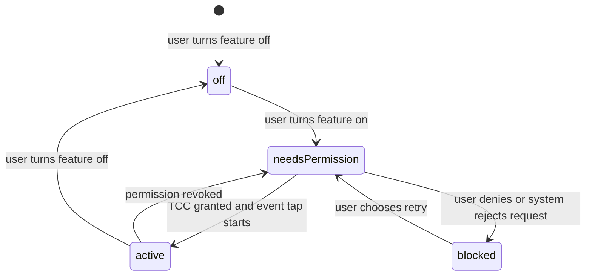
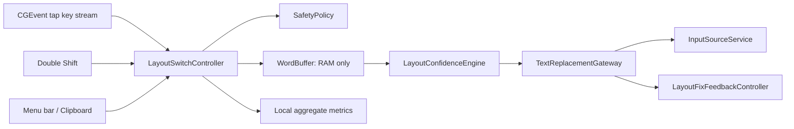

# ITER-062 — Local RU↔EN auto layout switch

**Status:** planned; no product source changes yet.
**Date:** 2026-08-16
**Decision:** ship the local RU↔EN layout switcher to Free users. The user
preference defaults to ON; runtime activation is gated by macOS permission.

## 0. Goal, non-goals, and Definition of Done

### Goal

While a user types in another macOS application, MetaWhisp detects a
high-confidence word typed in the wrong **US English / Russian** layout,
replaces that word, switches the active macOS layout for the following word,
and makes the action visibly understandable. No captured text leaves the Mac.

The same core engine supports a manual Double Shift correction without manual
selection. Selected text and explicit clipboard conversion remain deliberate
fallbacks.

### Non-goals for this iteration

- More than the fixed US English ↔ Russian pair. Layout discovery and mapping
  are designed to extend, but UX for more pairs is ITER-063.
- LLM translation, cloud requests, analytics upload, or a raw typing history.
- Single Shift as a shortcut: it collides with uppercase typing.
- Guaranteed editing inside every third-party application, password manager,
  terminal, RDP client, game, CAPTCHA, or IDE. Those contexts are denied or
  excluded by policy.

### Definition of Done

1. Fresh Free profile sees **Auto Layout Fix ON** by default, but MetaWhisp
   observes no global text until macOS permission is granted.
2. A signed app with permission transforms `ghbdtn ` into `привет ` and leaves
   the system input source Russian for the next word.
3. A normal English word such as `hello` is not transformed into `руддщ`.
4. Double Shift corrects the selected text when selection exists; otherwise it
   corrects the immediate previous word. It never behaves as a single-Shift
   layout toggle.
5. Every successful correction presents visible non-activating feedback and
   supports the target app's normal `Command-Z` undo.
6. Password/secure fields, Terminal/iTerm, Remote Desktop, configured app
   exclusions, navigation/edit operations, and low-confidence tokens never
   trigger automatic replacement.
7. Only aggregate local metrics are stored. No raw key, text, clipboard, or
   app title is written to logs, SwiftData, UserDefaults, or the network.
8. New unit tests, build, full test suite, signed-app manual matrix, and
   visual QA all pass before a release claim.

## 1. User stories and acceptance criteria

### US-1 — Automatic correction

As a Free user, I want a wrongly typed Russian or English word to be corrected
when I finish it, so I can keep writing without manually repairing it.

**Acceptance:** Auto Layout Fix is requested ON by default; with permission,
`ghbdtn ` becomes `привет ` in a supported editor within a perceptibly instant
interaction. Low-confidence candidates stay unchanged.

### US-2 — Permission honesty

As a new user, I want to understand why the switcher is not active before I
grant macOS permission, so the setting does not lie to me.

**Acceptance:** the setting has distinct `ON · Needs permission`, `ON · Active`,
and `OFF` states. A denied prompt does not repeatedly steal focus or re-prompt;
the user can open the required macOS pane from an explicit button.

### US-3 — Manual rescue

As a user, I want to press Double Shift to repair the selection or last word,
so I can fix a missed automatic correction immediately.

**Acceptance:** two clean Shift presses with no intervening key invoke one
correction. Existing Right Command and Right Option workflows remain unchanged.

### US-4 — Trustworthy feedback and undo

As a user, I want to see what changed and undo a mistake in the current app,
so automatic text changes never feel invisible or irreversible.

**Acceptance:** a 1.4-second non-activating toast shows language direction and
a privacy-safe before/after preview capped to 24 characters. It never takes
focus; `Command-Z` in the target app reverts the replacement.

### US-5 — Local, private statistics

As a user, I want useful correction counts without MetaWhisp retaining what I
typed, so I can assess the feature without sacrificing privacy.

**Acceptance:** Statistics shows aggregate Auto fixes, Double Shift fixes, and
observed immediate undo counts for Today / Week / All Time. No event text is
persisted; metric retention is bounded to daily aggregate buckets.

## 2. Product and UI contract

### Settings

Place a full-width **LAYOUT FIXER** card in `Settings → General`, immediately
below the existing Hotkeys / Overlay row. This is a system interaction feature,
not dictation, translation, or Second Brain; do not create a sixth tab.

```text
LAYOUT FIXER                                      ON · ACTIVE
Fix typed words between English (US) and Russian

Automatic correction                              [on]
Double Shift: Fix selection or last word          [on]
Switch input source after correction              [on]

Privacy: no typed text leaves your Mac            LOCAL
Excluded apps                                     [Manage…]
Statistics                                        24 auto · 3 manual today
```

When TCC access is absent, replace `ON · ACTIVE` with `ON · NEEDS PERMISSION`
and show one explicit **Allow in System Settings** button. The toggle still
means the user wants this feature enabled; it is not evidence that it can run.

### Onboarding and menu bar

- Add an optional `Layout Fixer` row to the existing Permissions onboarding
  page. Explain that permission is needed to correct text in other apps;
  completion of onboarding remains possible without it.
- Menu bar: status `LAYOUT: ACTIVE` / `NEEDS PERMISSION`, actions **Fix Last
  Word (⇧⇧)**, **Fix Clipboard**, and **Open Layout Settings**.

### Visual feedback

Do not attempt to colour arbitrary text inside another application: macOS has
no safe universal rich-text overlay. Instead add `LayoutFixFeedbackController`,
an independent non-activating `NSPanel` at the top centre of the active screen:

```text
  RU  Layout fixed
  ghbdtn  →  привет                 ⌘Z to undo
```

It is visible for 1.4 seconds, never takes focus, and is suppressed while the
recording / voice-question pill owns the same visual territory. In that case,
use the existing in-app notification stack with a short informational card.

## 3. Permission state machine



`layoutFixEnabled` defaults to `true`; `LayoutFixRuntimeState` is derived at
launch, on foreground activation, and after the user explicitly requests
permission. **Only `active` creates a global event tap.** Accessibility/Input
Monitoring is a hard macOS security boundary, not a product limitation we can
silently bypass.

Clipboard-only conversion remains available without this permission. Selected
text and automatic / Double Shift conversion do not.

## 4. Architecture



| Component | Responsibility | Must not do |
| --- | --- | --- |
| `LayoutSwitchController` | Start/stop event tap, serialize corrections, route Double Shift. | Decide language or mutate UI directly. |
| `InputPermissionService` | Expose the four runtime states and permission route. | Pretend denied access is functional. |
| `KeyboardLayoutMapper` | Pure US↔RU physical-key transformation preserving case/punctuation. | Read system state or paste text. |
| `LayoutConfidenceEngine` | Score original and transformed token using local language recognition and a vetted local lexicon. | Call an LLM/network or auto-correct on script change alone. |
| `FocusedTextGateway` | Verify target is unchanged; replace text through AX, then guarded clipboard fallback. | Blindly paste after focus changed. |
| `LayoutSafetyPolicy` | Reject risky apps/fields and reset on edits/navigation/source switch. | Reuse Screen Context policy or store forbidden content. |
| `LayoutFixFeedbackController` | Show the short non-activating correction toast. | Reuse dictation stage state or activate MetaWhisp. |
| `LayoutFixMetricsStore` | Store bounded daily counts only in UserDefaults. | Persist text, titles, or key logs. |

### Automatic word flow

1. A listen-only event tap receives key events only while runtime state is
   `active`.
2. `LayoutSafetyPolicy` first rejects excluded apps, secure text fields,
   modifier shortcuts, composition/IME input, and any existing editing state.
3. `WordBuffer` retains virtual key, Shift state, current source id, and a
   capped in-memory token. Delete, arrow, mouse/focus change, Return, manual
   layout change, or buffer overflow reset it.
4. On a separator, the mapper generates the other-layout candidate.
5. The confidence engine transforms only when the candidate is sufficiently
   recognisable in the target language and the original is not an ordinary
   source-language word. Initial thresholds favour false negatives over false
   positives.
6. `FocusedTextGateway` revalidates front process/focused control, replaces
   precisely the buffered word, then calls `InputSourceService` so the next
   word begins in the target layout.
7. Feedback and aggregate metrics are emitted only after confirmed replacement.

### Manual Double Shift flow

Two clean Shift press/release cycles inside 400 ms invoke the same controller.
If text is selected, transform that exact selection. If not, acquire and
replace only the immediate last word. Explicit selected-text intent uses the
configured pair deterministically; last-word intent may use a lower confidence
threshold than auto mode. Both still refuse secure/excluded fields.

## 5. Privacy, statistics, and production safety

### Aggregate metrics retained locally

`LayoutFixDailyMetrics(date, autoFixed, manualFixed, observedUndo, skipped)`
is encoded in UserDefaults, capped at 90 daily buckets. `skipped` is one
aggregate count, not a reason-plus-text event. The Statistics UI exposes only:

- automatic corrections;
- manual Double Shift corrections;
- immediate undo count, inferred only while a recent correction window is
  active;
- a transparent *approximate* saved-time estimate only after the count has
  enough data, labelled with its fixed per-correction assumption.

Do not store token values in metrics, NSLog, `HistoryItem`, SwiftData, support
exports, or crash reports. Do not add a new SwiftData model for this v1 metric:
that would expand a migration-sensitive surface for no product value.

### Default app policy

Block automatically in Terminal, iTerm, Remote Desktop, known password
managers, browser password/secure fields, games, and configured exclusions.
An explicitly selected manual conversion is allowed only after the same secure
field check; Terminal/RDP remain blocked by default. The user may add/remove
ordinary application exclusions in Settings.

## 6. Iteration plan

### Master checklist

- [x] Product decisions, user stories, permission model, UI contract
- [x] Architecture, privacy contract, metrics design, QA matrix
- [ ] I0 — signed TCC/event-tap proof of capability
- [ ] I1 — pure RU↔EN mapper and confidence engine (TDD)
- [ ] I2 — safe replacement gateway and input-source switch (TDD)
- [ ] I3 — controller, auto flow, and Double Shift (TDD)
- [ ] I4 — Settings, onboarding, feedback, menu bar, statistics
- [ ] I5 — production manual matrix, accessibility review, release gates
- [ ] ITER-063 — additional language-pair product design and implementation

### I0 — Platform proof before feature code

**Checklist:**

- Re-read `AGENTS.md`, this spec, and `specs/iterations/PROGRESS.md`.
- In the installed Developer-ID signed app, prove creation/lifecycle of the
  selected event-tap mode and each permission state without logging text.
- Validate revocation and re-grant while the app is running.
- Test whether direct AX selected-text replacement works in a native field and
  Chromium text field; record fallback requirements.
- Do not merge product logic from a speculative TCC API name; compile against
  the installed macOS SDK and retain only verified calls.

**Gate:** signed-app evidence is recorded. If global tap cannot work under the
current signing/distribution model, stop before I1 and revise the architecture.

### I1 — Pure conversion and confidence engine

**Red tests first:** fixed RU↔EN mapping, upper/lowercase, punctuation, emoji,
numbers, unmapped characters, `ghbdtn → привет`, `руддщ → hello`, and
`hello`/`привет` rejected in automatic mode.

**Implementation:** `KeyboardLayoutMapper`, `LayoutPair`, `WordBuffer`, and
`LayoutConfidenceEngine` contain no AppKit/TCC/UI/clipboard calls.

**Gate:** deterministic XCTest coverage passes; every false-positive fixture is
green before I2 begins.

### I2 — Target-safe replacement

**Red tests first:** no write on changed target; saved clipboard restored only
if change count still belongs to MetaWhisp; secure/excluded field skip; source
switch only after confirmed replacement.

**Implementation:** extract a shared `FocusedTextGateway` from the current
selection translation seam; use AX preferred and a verified clipboard fallback.
`InputSourceService` selects Russian/US only through verified system sources.

**Gate:** existing `TextInsertionClipboardTests` remain green; manual native
field and Chromium replacement succeeds without permanently replacing a user
clipboard.

### I3 — Controller and input paths

**Red tests first:** state transitions, one correction at a time, separator
flow, buffer resets, 400-ms Double Shift, off/needsPermission/blocked states,
and no event tap while disabled.

**Implementation:** `LayoutSwitchController` owns the monitor and serial task;
both auto and Double Shift route through it. Existing Right Command / Option
registrations stay isolated.

**Gate:** full XCTest suite green and signed-app smoke shows no duplicate
correction, focus theft, or text leak in logs.

### I4 — User surfaces and aggregate metrics

**Red tests first:** settings defaults, status derivation, metric retention,
toast state/timeout, and Statistics formatting.

**Implementation:** General card, onboarding row, menu bar state/actions,
feedback controller, local metric store, and Statistics card. Copy is English
in the shipped UI.

**Gate:** visual QA at normal/fullscreen Spaces; feedback does not overlap the
recording/voice overlay or force app activation.

### I5 — Production verification and release

**Manual matrix:** fresh user TCC decline/grant/revoke, Notes/TextEdit,
Safari, Chrome, Slack/Telegram, VS Code, password field, Terminal/iTerm,
Remote Desktop, fullscreen app, two monitors, rapid typing, rapid Double
Shift, user copy during fallback, and `Command-Z` immediately after a fix.

**Release gate:** `swift build`, full `swift test`, static parse of touched
files, Developer-ID signed bundle, notarization flow, review of logs for raw
text, and a manual browser/editor evidence record. No claim of universal app
support without this matrix.

## 7. Explicit trade-offs

| Decision | Chosen | Why |
| --- | --- | --- |
| Default | requested ON, effective only with permission | Matches desired UX without violating macOS privacy boundary. |
| Scope | RU↔EN only | Enables a reliable confidence model before multi-pair complexity. |
| Confidence | strict local model + lexicon | A missed fix is cheaper than corrupting a correct word. |
| Feedback | dedicated top-centre toast | Immediate and visible without modifying foreign-app rich text. |
| Metrics | local aggregates | Gives useful product signal without becoming a keylogger. |
| Persistence | UserDefaults, 90-day daily buckets | Avoids an unjustified SwiftData migration. |
| Manual trigger | Double Shift only | Does not break normal Shift/capitalisation. |

## 8. Follow-up: ITER-063 language pairs

After I5 telemetry and false-positive review, add a user-configured pair model
backed by installed macOS input sources. It will not assume that an arbitrary
script pair has a safe automatic confidence model. Each added pair needs its
own fixtures, confidence corpus/licensing review, exclusion matrix, and manual
QA. Manual selected-text conversion may support a pair before automatic mode
does.
